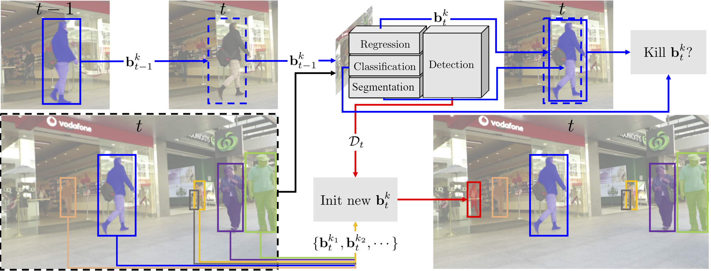

# Tracking without bells and whistles

This repository provides an extension of the paper **Tracking without bells and whistles** (Philipp Bergmann, [Tim Meinhardt](https://dvl.in.tum.de/team/meinhardt/), [Laura Leal-Taixe](https://dvl.in.tum.de/team/lealtaixe/)) [https://arxiv.org/abs/1903.05625]. Instead of using bounding boxes to track objects, we do a full segmentation of each object. This was made possible by the MOTS dataset which provides pixelwise segmentations for some of the individual objects on four of the seven scenes of MOT17 Dataset. 

In addition to our analysis of problems that arise when using MOTS dataset to improve the tracking on MOT17 Dataset, we also provide sample videos of the results [web-video-collection](https://vision.in.tum.de/webshare/u/meinhard/tracking_wo_bnw-supp_video_collection.zip).



## Python Notebooks

We provide two Google-Colab Notebooks: One which we used to train and evaluate a Mask-RCNN using the MOTS-Dataset, and one that evaluates the tracking performance of our Tracktor Add-On on the MOTSP-Dataset. You can modify settings in the respective notebook.
[Mask-RCNN] (https://drive.google.com/open?id=1UbvTuK2aFsS2LIQ2h8m70oofINyQykU2), 
[Tracktor-Add-On](https://drive.google.com/open?id=1ABnb2QxXfCxF9Vh75PbMXbaxppTceyGY)

## Publication
 If you use this software in your research, please cite the corresponding publication:

```
  @InProceedings{tracktor_2019_ICCV,
  author = {Bergmann, Philipp and Meinhardt, Tim and Leal{-}Taix{\'{e}}, Laura},
  title = {Tracking Without Bells and Whistles},
  booktitle = {The IEEE International Conference on Computer Vision (ICCV)},
  month = {October},
  year = {2019}}
```
